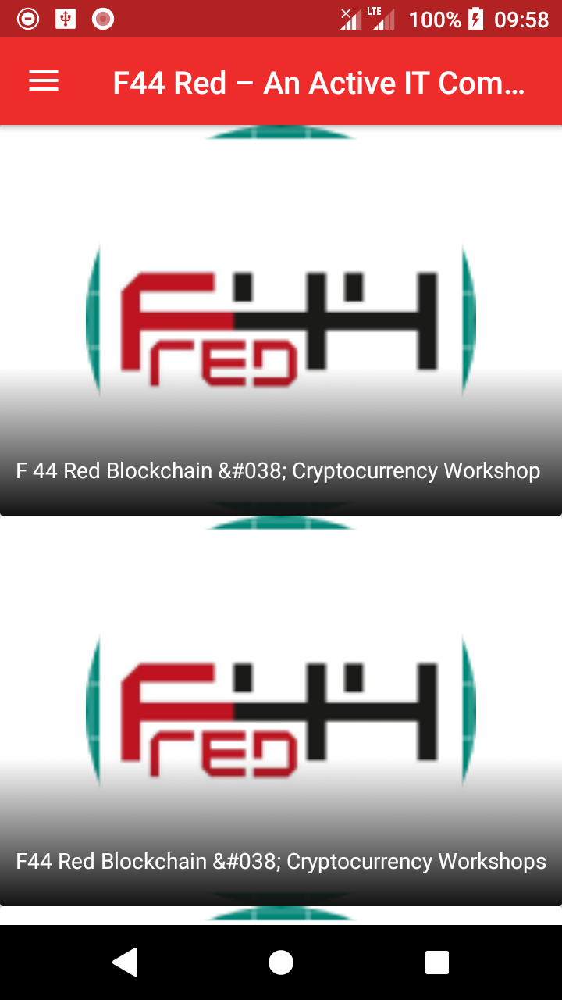

# F44Red

Mobile version of site http://f44red.com/ which allows you to be up-to-date with the latest events organized by F44Red Scientific Club.

## Table of Contents
* [General info](#general-info)
* [Technologies](#technologies)
* [Setup](#setup)

## General info
This project was created for faster access to the newest events published on site http://f44red.com/. That way we can avoid repeated
clicking in the web browser (both desktop and mobile) - all you need to do is just tap on app icon in your phone and you will be 
up-to-date with the newest posts!

Below screenshot showing how F44Red app looks:

## Technologies
This application is created with Android which contains additional technologies:
* Gradle version: 3.4.1
* Retrofit version: 2.0.2
* OneSignal version: 3.7.1
* Google Services version: 4.1.0

## Setup
To run this project, unzip it in Android Studio's default project folder (Android Studio) and then open it in IDE. When Android Studio finishes downloading required libraries, connect your phone with your computer with USB cable and then hit 'Run' option. (or run in emulator).
